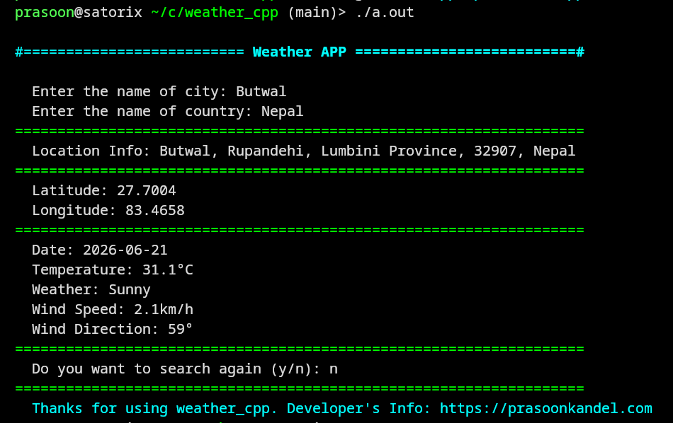

# Weather Cpp
**Weather Cpp is a simple terminal-based weather app built with C++.** It will help you know weather outside just from your terminal.


# Features
- Get full location if city by only entering countryname and cityname.
- Get Latitude and longitude of the city.
- Get current date of the city.
- Get current weather
- Get current temperature, wind speed and wind direction.

## Demo Output:
The demo output of this project is presented below:



## Requirements

- Linux/macOS/Windows
- C++11 (or later) compatible compiler (`g++` recommended)
- Single header file liabraries:  and 

## Working Principle 
First of we must input the name of the city and country.

After entering the cityname and countryname the, app searches full location of the city will be displayed. The latitude and longitide will be shown respectively fetching. Following that the weather information will be fetched and displayed.

At the end, the program will ask if you want to search again or  not (y/n).

## Project Structure:
The structure of the files and subfolders of this project is presented below:


**All the external libraries are kept in `/external` directory.**

## Build Command:

```bash
g++ -std=c++11 weather_cpp main.cpp operations.cpp -o app -lssl -lcrypto -pthread
```
