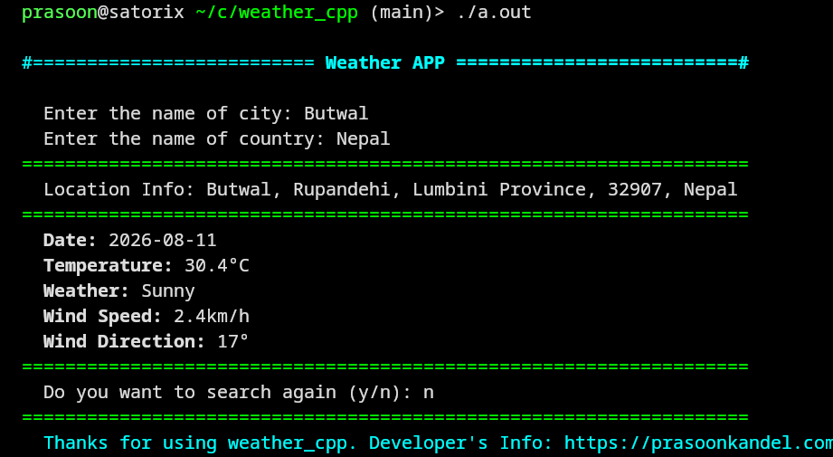
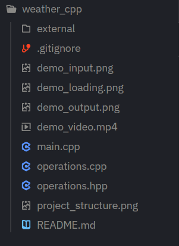

# Weather Cpp
**Weather Cpp is a simple terminal-based weather app built with C++.** It will help you know weather outside just from your terminal. This programming uses the advance concepts of Object Oriented Programming so, you can learn OOP pratically by analyzing this codebase.


**Version: v1.1**

## Features
- Get current date of the city.
- Get current weather (rain, sunny, cloudy etc.)
- Get current temperature, wind speed and wind direction.
- Colourful Output using ANSI colour codes.

## Demo Output:
The demo output of this project is presented below:



## Requirements

- Linux/macOS/Windows
- C++11 (or later) compatible compiler (`g++` recommended)
- Single header file liabraries:  and 

## Working Principle 
First of we must input the name of the city and country.

After entering the query of location the, app searches for a location query that has weather details. Then it shows actual location that is stored in servers. The date and other other info will be displayed.

At the end, the program will ask if you want to search again or  not (y/n).

## Project Structure:
The structure of the files and subfolders of this project is presented below:



**All the external libraries are kept in `/external` directory.**

## Build Command:

```bash
g++ -std=c++11 weather_cpp main.cpp operations.cpp -o app -lssl -lcrypto -pthread
```
